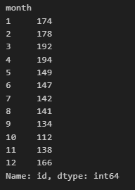

# Web Scraping with Beautiful Soup Challenge

[Scrape Mars News Code Link]( https://github.com/MichaelELeonard/Web-Scraping-Challenge/blob/main/part_1_mars_news_working.ipynb)

[Scrape and Analyze Mars Weather Data Code Link]( https://github.com/MichaelELeonard/Web-Scraping-Challenge/blob/main/part_2_mars_weather_working.ipynb)

## Goals
* Scrape Titles and Preview Text from Mars News
* Scrape and Analyze Mars Weather Data

## SCRAPE TITLES AND PREVIEW TEXT FROM MARS NEWS

* Automated browsing (with Splinter) was used to visit the Mars news site, and the HTML code was extracted (with Beautiful Soup).
* The titles and preview text of the news articles were scraped and extracted.
* The scraped information was stored in the specified Python data structure—specifically, a list of dictionaries.

## SCRAPE AND ANALYZE THE MARTIAN WEATHER DATA
The HTML table was extracted into a Pandas DataFrame and Splinter and Beautiful Soup were used to scrape the data. The data was analyzed to answer the following questions:

  * How many months exist on Mars? 

  * How many Martian days' worth of data is in the dataset? 

 
  * Display the average Martian low temperature by month

  * Plot the average Martian low temperature by month 

  * Plot the average Martian low temperature by month in ascending order

* Display the average Martian atmospheric pressure by month

* Identify which months with the lowest and highest atmospheric pressure 

 * Plot how many terrestrial (earth) days exist in a Martian year

